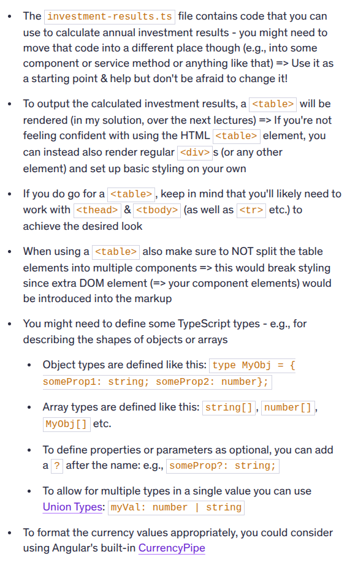

# Making new components using NG CLI

`ng generate component <component-name> [options]`

OR

`ng g c koko-component`

# Binding ts. component logic with html tempolate of a component

1. Sting interpolation i.e. using double curly bracket {{}} in HTLM of the component to access the public properties of the ts logic

# Attribute Binding

In the previous lecture, you were introduced to **Property Binding** — a key Angular feature that allows you to bind element properties to dynamic values.

For example:

```html

```

This binds the `src` property of the underlying `HTMLImageElement` DOM object to the value stored in `someSrc`.

While it might look like you're binding the `src` attribute of the `` tag, you're actually **not** doing that. Instead, property binding targets the underlying DOM object **property** (which, in this case, also happens to be called `src`) and binds to that.

This might seem like a subtle distinction (and often it doesn’t make a difference), but it’s important to understand the difference between element **attributes** and **properties**. This [article](https://developer.mozilla.org/en-US/docs/Web/HTML/Attributes) can help clarify this difference.

Although in many Angular apps this won’t affect the outcome, it **does** matter when you’re trying to set **attributes** on elements dynamically — especially attributes that **don’t** have a corresponding property.

For example, when binding ARIA attributes, you can’t target a corresponding DOM property.

Since **Property Binding** targets properties (not attributes), that presents a problem. Angular addresses this with a variation of the property binding syntax that allows you to bind attributes to dynamic values.

It looks like this:

```html
<div role="progressbar" [attr.aria-valuenow]="currentVal" [attr.aria-valuemax]="maxVal">...</div>
```

By adding `attr.` in front of the attribute name, you’re telling Angular **not** to look for a property with that name, but instead to bind directly to the **attribute**.

In the example above, the `aria-valuenow` and `aria-valuemax` attributes are bound dynamically.
