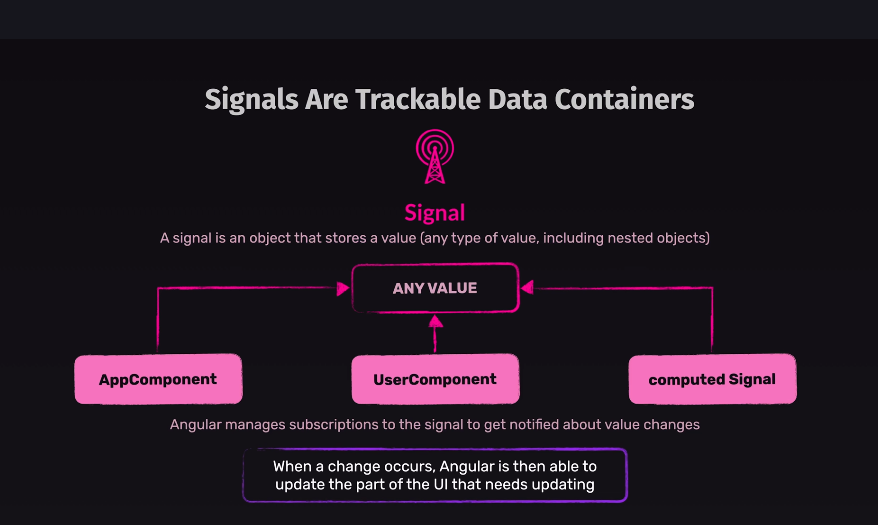

# Making new components using NG CLI

`ng generate component <component-name> [options]`

OR

`ng g c koko-component`

# Binding ts. component logic with html tempolate of a component

1. Sting interpolation i.e. using double curly bracket {{}} in HTLM of the component to access the public properties of the ts logic

# Attribute Binding

In the previous lecture, you were introduced to **Property Binding** — a key Angular feature that allows you to bind element properties to dynamic values.

For example:

```html

```

This binds the `src` property of the underlying `HTMLImageElement` DOM object to the value stored in `someSrc`.

While it might look like you're binding the `src` attribute of the `` tag, you're actually **not** doing that. Instead, property binding targets the underlying DOM object **property** (which, in this case, also happens to be called `src`) and binds to that.

This might seem like a subtle distinction (and often it doesn’t make a difference), but it’s important to understand the difference between element **attributes** and **properties**. This [article](https://developer.mozilla.org/en-US/docs/Web/HTML/Attributes) can help clarify this difference.

Although in many Angular apps this won’t affect the outcome, it **does** matter when you’re trying to set **attributes** on elements dynamically — especially attributes that **don’t** have a corresponding property.

For example, when binding ARIA attributes, you can’t target a corresponding DOM property.

Since **Property Binding** targets properties (not attributes), that presents a problem. Angular addresses this with a variation of the property binding syntax that allows you to bind attributes to dynamic values.

It looks like this:

```html
<div role="progressbar" [attr.aria-valuenow]="currentVal" [attr.aria-valuemax]="maxVal">...</div>
```

By adding `attr.` in front of the attribute name, you’re telling Angular **not** to look for a property with that name, but instead to bind directly to the **attribute**.

In the example above, the `aria-valuenow` and `aria-valuemax` attributes are bound dynamically.

# Difference between attributes and properties

https://jakearchibald.com/2024/attributes-vs-properties/

# Change detection in angular uses zone.js internally


# Signals



First we set the signals using signal function from angular core
e.g. `electedUser = signal(DUMMY_USERS[randomIndex]);`

Then when we want to update the signal valuev we use set function e.g.

```
onSelectUser() {
    const randomIndex = Math.floor(Math.random() * DUMMY_USERS.length);
    this.selectedUser.set(DUMMY_USERS[randomIndex]);
  }
```

When we want to RETIRVE VALVE OF A LIVE SIGNAL IN TS i.e. we need to compute stuff on signal we use compute from the angular core library
` imagePath = computed(() => 'assets/users/' + this.selectedUser().avatar);`

NOW IN HTML, we use round bracket () to give subscription of signal to the html and incase needed to have attributed use . dot function

```
<div>
  <button (click)="onSelectUser()">
    
    <span>{{ selectedUser().name }}</span>
  </button>
</div>
```

# How to pass information between components ?

1.  From using app.html,we can give parameters to child components using [name] and then use @Input in child components to get that value.
    e.g.
    ```
    <app-task [name]="selectedUser!.name"></app-task>
    ```
    then inside app tasks.ts
    e.g.

```
    export class TaskComponent
    {
    @Input({ required: true }) name!: string;
    }

```

When to use get/getter in AngularJS ?

## When to use `get`/getter in Angular?

In Angular, use a getter (the `get` keyword) when you want to expose a computed, read-only property to your template or other code, without calling it like a function. Getters are especially useful for:

- **Computed values:** When a value depends on other properties and should be calculated dynamically.
- **Template binding:** So you can use `{{ propertyName }}` or `[property]="propertyName"` in your template, instead of `propertyName()`.

### Example 1: Getter for a computed property

**Component:**

```typescript
export class UserComponent {
  firstName = "Jane";
  lastName = "Doe";

  get fullName(): string {
    return `${this.firstName} ${this.lastName}`;
  }
}
```

**Template:**

```html
<p>{{ fullName }}</p>
```

### Example 2: Getter for conditional logic

**Component:**

```typescript
export class TaskComponent {
  isComplete = false;

  get status(): string {
    return this.isComplete ? "Done" : "Pending";
  }
}
```

**Template:**

```html
<span>{{ status }}</span>
```

### When to use a getter

- When you want to expose a value to the template that is derived from other properties.
- When you want to encapsulate logic for a property without requiring a method call in the template.

### When **not** to use a getter

- If the computation is expensive and runs often (getters are called on every change detection cycle).
- If you need to perform side effects (getters should be pure).

**Summary:**  
Use `get` in Angular for computed, read-only properties you want to use in templates as if they were simple properties.
